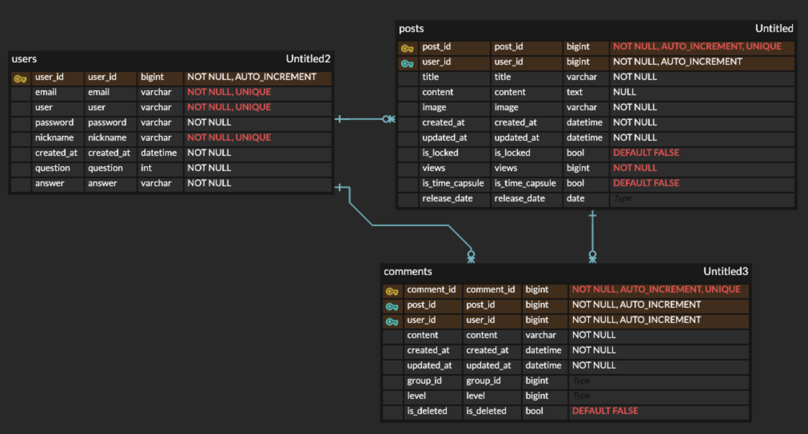
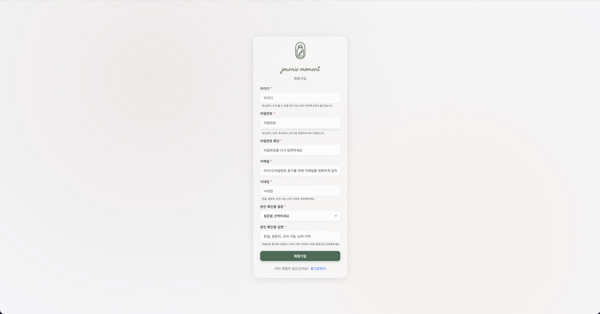
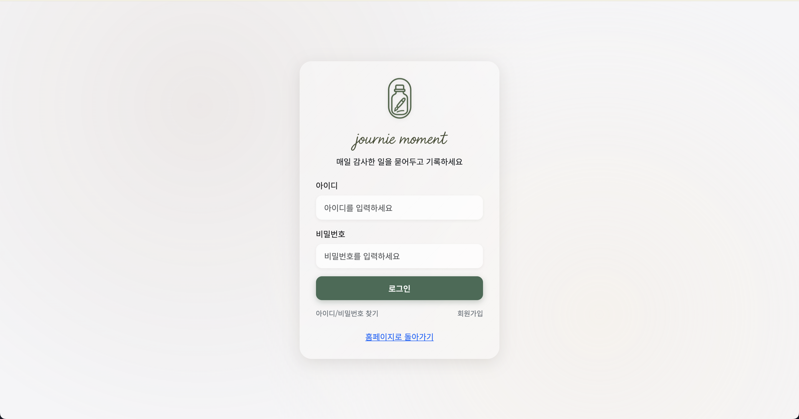
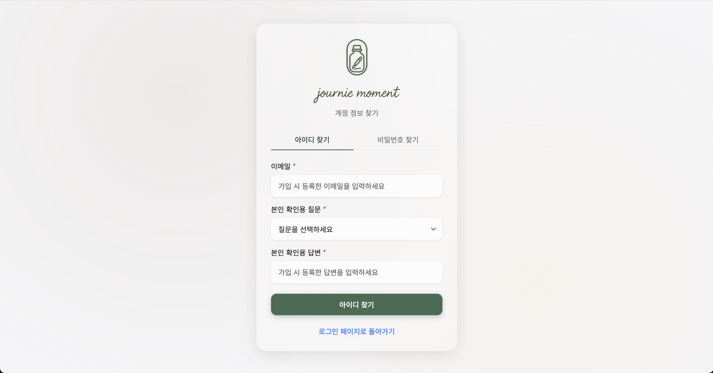
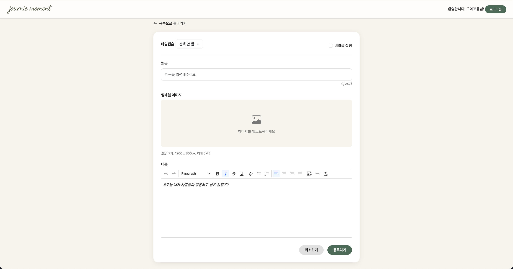
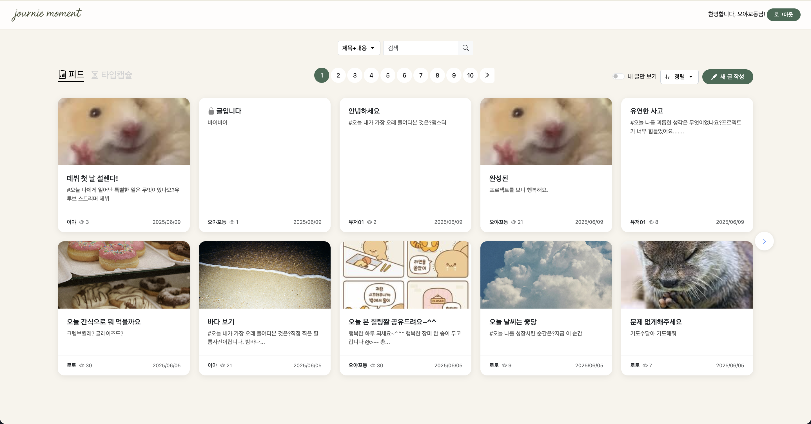
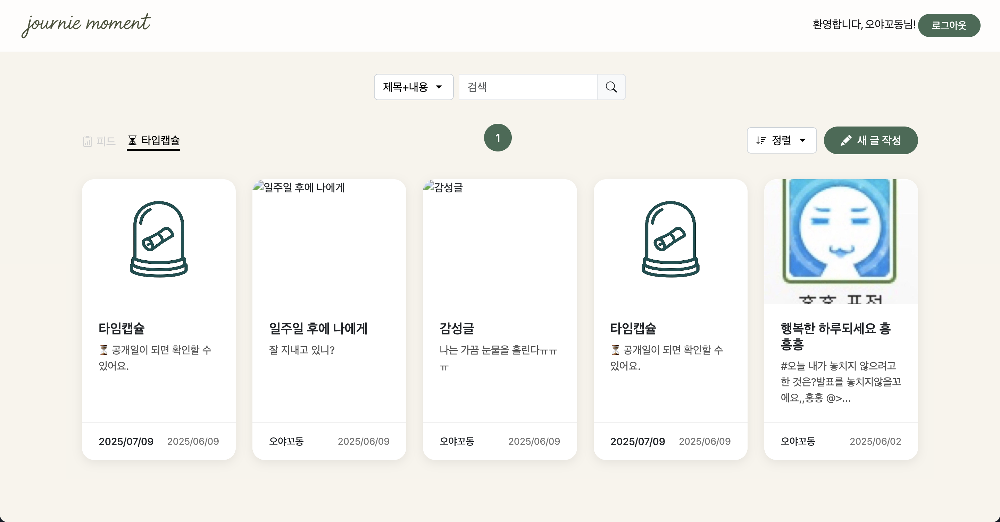
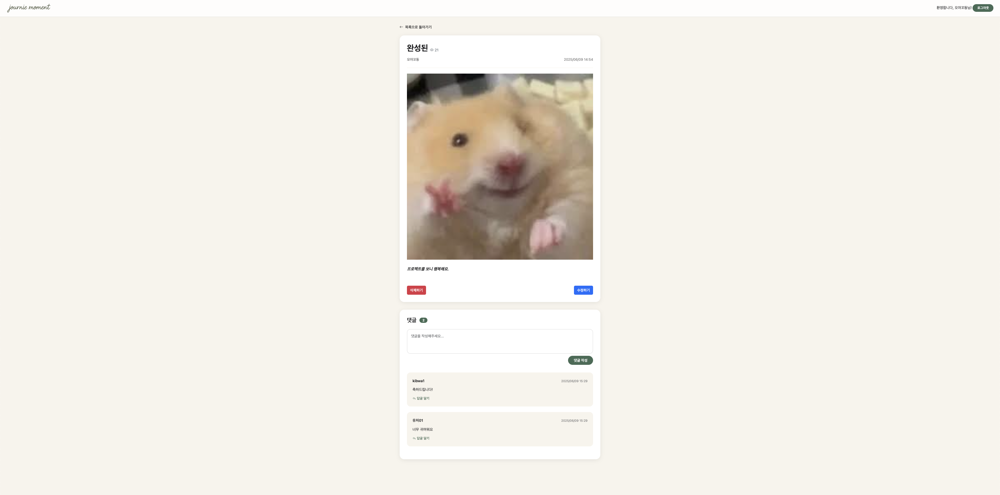
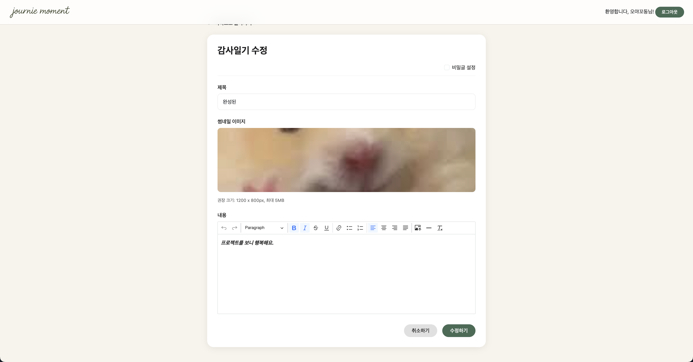

# Journie Moment

<p align="center">
<div align="center"s></div>
<div align="center"s></div>
</p>

# 📌 프로젝트 소개

- 하루 동안 감사했던 일을 기록하고, 특정 날짜가 되면 꺼내볼 수 있는 **타임캡슐형 감사일기 게시판**입니다.
- 바쁜 일상 속 감사한 순간을 기록하며, 미래의 나에게 긍정적인 메시지를 전하고자 기획되었습니다.

<br>
<br>

# 🎯 주요 기능

- **회원가입 / 로그인 / 아이디 및 비밀번호 찾기**
  - Bcrypt 라이브러리를 사용한 비밀번호 단방향 암호화 적용
  - 간단한 회원가입 및 로그인 기능 구현
- **감사일기 작성**
  - 제목, 썸네일 이미지, 본문 작성 기능
  - CKEditor5를 사용한 텍스트 에디터 도입으로 다양한 서식 및 이미지 삽입 등 지원
  - 작성에 영감을 주는 랜덤 질문 제공
  - 공개/비공개 설정 가능
  - 타임캡슐 날짜 지정 → 지정된 날짜 이전에는 본인 포함 누구도 열람 불가
- **일기 목록 및 상세 조회**
  - 최신순, 오래된 순, 인기순 정렬 기능
  - '나만 보기' 설정된 일기 필터링
  - 타임캡슐 일기만 모아보기 기능 제공
- **일기 수정 및 삭제**
  - 작성자가 작성한 일기를 자유롭게 수정/삭제 가능
- **검색 기능**
  - 제목 및 내용, 또는 작성자 이름 기준으로 일기 검색 가능

<br>
<br>

# 🛠 기술 스택

## Front-End

[](#)
[](#)
[](#)\
[](#)

## Back-End

[](#)
[](#)

## Database

[](#)

## Tools

[](#)
[](#)


## Deployment

[](#)

<br>
<br>

# 🗂️ 프로젝트 구조

```
📦
├─ .gitignore
├─ README.md
└─ perfectJournal
   ├─ mvnw
   ├─ mvnw.cmd
   ├─ new_diagram.uxf
   ├─ pom.xml
   └─ src
      └─ main
         ├─ .DS_Store
         ├─ java
         │  └─ com
         │     └─ pj
         │        └─ journal
         │           ├─ PerfectJournalApplication.java
         │           ├─ controller
         │           │  ├─ BoardController.java
         │           │  ├─ CommentController.java
         │           │  ├─ ImageUploadController.java
         │           │  ├─ TimeController.java
         │           │  └─ UserController.java
         │           ├─ model
         │           │  ├─ board
         │           │  │  ├─ BoardDao.java
         │           │  │  └─ BoardVo.java
         │           │  ├─ comment
         │           │  │  ├─ CommentDao.java
         │           │  │  └─ CommentVo.java
         │           │  └─ user
         │           │     ├─ UserDao.java
         │           │     └─ UserVo.java
         │           └─ service
         │              ├─ BoardService.java
         │              ├─ CommentService.java
         │              ├─ SftpUploader.java
         │              ├─ TimeService.java
         │              └─ UserService.java
         └─ resources
            ├─ META-INF
            │  └─ additional-spring-configuration-metadata.json
            ├─ application.properties
            ├─ mappers
            │  ├─ board-mapper.xml
            │  ├─ comment-mapper.xml
            │  └─ user-mapper.xml
            ├─ mybatis-config.xml
            ├─ static
            │  ├─ css
            │  │  ├─ board
            │  │  │  ├─ createPost.css
            │  │  │  ├─ detail.css
            │  │  │  ├─ editPost.css
            │  │  │  └─ home.css
            │  │  ├─ common
            │  │  │  └─ common.css
            │  │  └─ user
            │  │     ├─ changePw.css
            │  │     ├─ find.css
            │  │     ├─ login.css
            │  │     └─ register.css
            │  ├─ images
            │  │  ├─ logo.png
            │  │  ├─ logoIcon.png
            │  │  └─ timeCapsule.png
            │  ├─ js
            │  │  └─ ckeditor.js
            │  └─ questions.json
            └─ templates
               ├─ board
               │  ├─ createPost.html
               │  ├─ detail.html
               │  ├─ editPost.html
               │  ├─ home.html
               │  ├─ timeCapsule.html
               │  └─ timeDetail.html
               ├─ layout
               │  └─ header.html
               └─ user
                  ├─ changePw.html
                  ├─ find.html
                  ├─ login.html
                  └─ register.html
```

<br>
<br>

# 💾 데이터베이스 구조

- [👉 ERDCloud]("https://www.erdcloud.com/d/s42uK6nQ43dRgtBMc")



<br>
<br>

# 🖼️ 주요 화면

## 회원가입 / 로그인 / 아이디 및 비밀번호 찾기





## 감사일기 작성



## 목록 조회



## 타임캡슐 목록 조회



## 상세 페이지



## 수정 페이지



<br>
<br>

# 🧠 트러블슈팅 & 핵심 기술

- 타임캡슐 날짜 제한 로직
  - 사용자가 설정한 날짜 이전에는 본인조차 열람할 수 없도록 현재 날짜와 비교하여 접근을 제한
- 텍스트 에디터 적용
  - CKEditor5를 도입하여 글 작성 시 다양한 서식, 이미지 삽입 등 사용자 편의성 강화
- 비밀번호 변경 시 사용자 정보 인식 불가 문제
  - 비밀번호 변경 기능 구현 중, 세션에 사용자 ID가 저장되지 않아 이후 단계에서 사용자 정보 확인이 불가한 현상 발생
  - 원인은 조건문 내 notFound 처리: 실제 데이터가 존재함에도 불구하고 잘못된 조건 분기로 인해 return이 발생하고, 세션 저장 코드가 실행되지 않음
  - System.out.println()을 활용해 흐름을 추적하고, 조건문을 수정하여 불필요한 return 제거
  - 로직 흐름 제어의 중요성과 디버깅을 통한 문제 해결 경험을 얻음
- 타임캡슐 일기 노출 오류
  - 설정한 공개일이 지났음에도 게시글이 노출되지 않는 문제 발생
  - 원인은 잘못된 자료형 사용과 Thymeleaf를 이용한 UI 조건 분기 처리 미흡
  - 날짜 계산에 적합한 자료형으로 수정하고, releaseDate 기준으로 공개/비공개 상태를 조건부 출력하여 문제 해결
  - 자료형의 정확한 선택과 UI 렌더링 시 조건 처리의 중요성을 체감

<br>
<br>

# 🪞 회고

### 💡 배운 점

- 개발 전 기획 및 문서화 작업의 중요성을 체감
- 팀원 간의 지속적인 소통이 개발 효율성과 완성도에 큰 영향을 미친다는 점을 경험
- 외부 라이브러리(CKEditor, BCrypt 등)의 구조를 이해하고 적용하는 능력 향상
- RESTful API 설계와 MVC 패턴에 대한 실전 감각 강화

### 😓 아쉬운 점

- 팀원 간의 소통이 원활하지 않아 일부 작업에서 협업에 어려움이 있었음
- 제한된 시간 내 구현 범위 설정 미흡으로 인해 일부 기능이 누락됨
- 테스트 코드 작성이 부족해 유지보수성과 안정성이 다소 떨어졌던 점

### 🔧 향후 개선 방향

- 감정 분석 기능 추가: 감정 키워드 통계를 통해 사용자에게 회고 메시지 및 인사이트 제공
- 보안 기능 강화: Spring Security 등 검증된 프레임워크를 적용해 인증 및 권한 관리 체계 강화
- 마이페이지 고도화: 회원 정보 수정 등 개인화 기능 추가로 사용자 편의성 증대

<br>
<br>

# 팀원 구성

<table>
<thead>
<tr>
<th align="center"><strong>장민호</strong></th>
<th align="center"><strong>오영화</strong></th>
<th align="center"><strong>안혜빈</strong></th>
<th align="center"><strong>이예은</strong></th>
<th align="center"><strong>이민수</strong></th>
</tr>
</thead>
<tbody>
<tr>
<td align="center"><a href="https://github.com/minho00123"> <br> @minho00123</a></td>
<td align="center"><a href="https://github.com/hwa3845"> <br> @hwa3845</a></td>
<td align="center"><a href="https://github.com/HBinAhn"> <br> @HBinAhn</a></td>
<td align="center"><a href="https://github.com/rot-notrotten"> <br> @rot-notrotten</a></td>
<td align="center"><a href="https://github.com/leeminsu93"> <br> @leeminsu93</a></td>
</tr>
</tbody>
</table>
